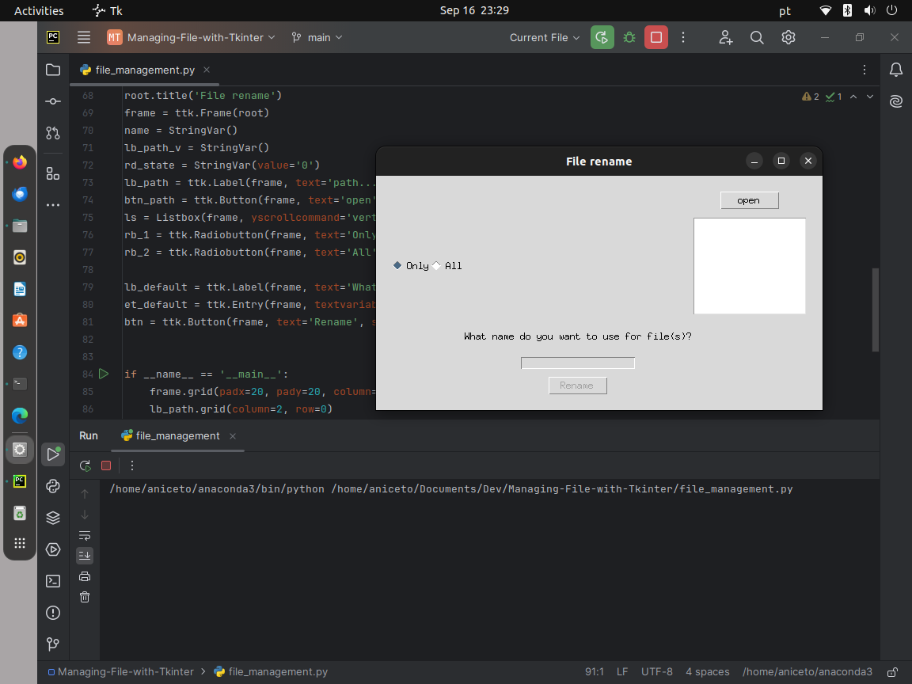
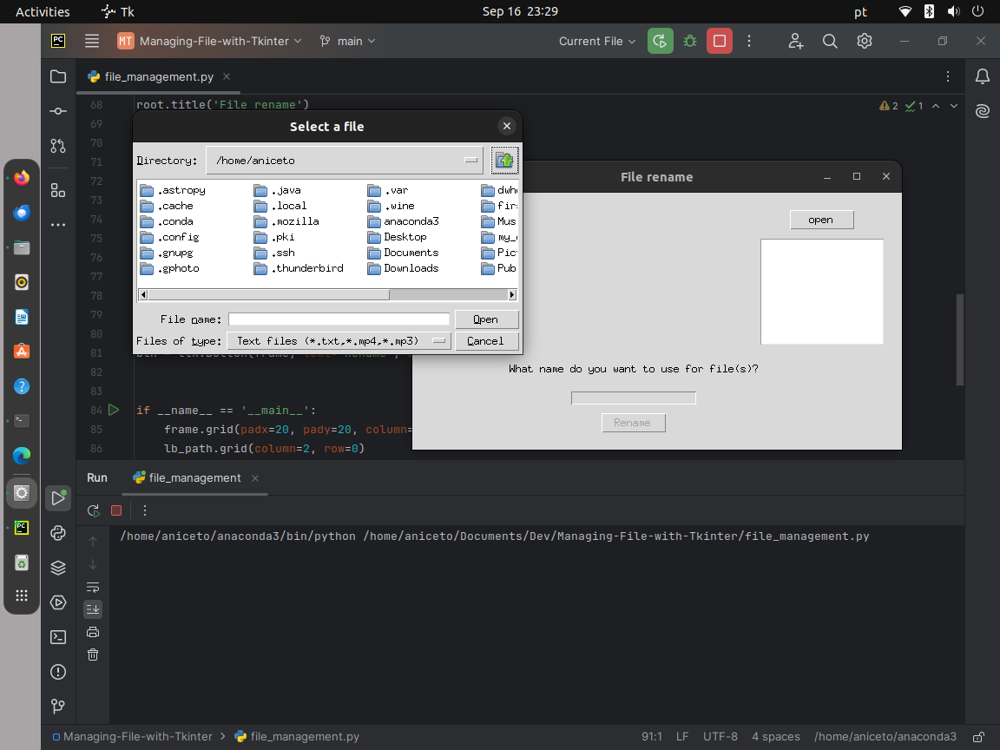

# Managing-File-with-Tkinter
Creation of a small file management system using the TKINTER GUI.


#### App
[file_management](app/dist/file_management)

> Executable app path -> app/dist/file_management

#### Convert Tkinter Python App to Executable (.Exe) File [pyinstaller]

1.
```shell
pip install pyinstaller
```
2.
```shell
pyinstaller file_name.py

or

pyinstaller file_name.py --onefile

or

pyinstaller file_name.py --onefile -w
```
#### Files



#
#
###### Author : Aniceto Jolela 🥰
 My  | [Linkedin](https://www.linkedin.com/in/aniceto-jolela-076547184/))